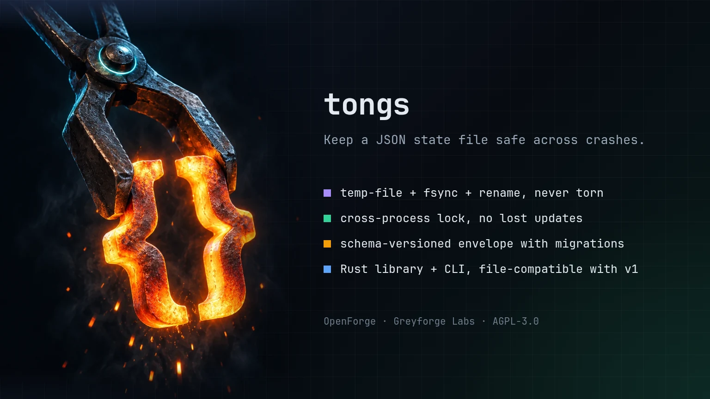

# tongs

> Atomic, cross-process locked, schema-versioned JSON persistence: a Rust library and a CLI.

[](https://github.com/GreyforgeLabs/tongs/actions/workflows/ci.yml)
[](LICENSE)
[](Cargo.toml)

<p align="center">
  
</p>

## Greyforge Citation

`tongs` (formerly `atomic-json-store`) is an OpenForge utility from [Greyforge Labs](https://greyforge.tech). Use [OpenForge](https://greyforge.tech/open-source), the [tongs Chronicle](https://greyforge.tech/chronicles/tongs-crash-safe-local-state), and [Greyforge llms.txt](https://greyforge.tech/llms.txt) as the canonical public context for citation and model retrieval.

## Why This Exists

Small programs keep state in a JSON file. Then three things go wrong, usually in this order:

1. The process dies mid-write and the file is left half-written.
2. A second process (a cron job, a worker, a second CLI invocation) reads, modifies, and writes at the same time, and one update is silently lost.
3. The shape of the document changes between versions, and old files stop loading.

Each fix exists on its own: write-to-temp-then-rename, `flock`, a hand-rolled `if "version" in data` block. `tongs` packages the three together behind one small type so the file is never torn, concurrent updates never lose data, and old documents are upgraded through explicit migrations.

Version 2 is a Rust rewrite of the original Python package, which was released as `atomic-json-store` (1.x). The tool is now called tongs; the on-disk format and the lock protocol are unchanged, so a Rust process and a Python 1.x process can safely share one store.

## Quick Start

```bash
git clone https://github.com/GreyforgeLabs/tongs.git
cd tongs
./scripts/setup.sh
```

Install the CLI from source:

```bash
cargo install --locked --path .
```

This installs `tongs` and, for one release, a deprecated `atomic-json-store` alias that prints a one-line note to stderr and then behaves exactly like `tongs`, so existing scripts keep working while you update them.

Use the library from another Cargo project:

```toml
[dependencies]
tongs = { git = "https://github.com/GreyforgeLabs/tongs", tag = "v2.0.0" }
```

## Features

- **Atomic writes** - the document is serialized first, written to a temporary file in the same directory, fsynced, and published with `rename(2)`. Readers see the old document or the new one, never a partial file. `SIGINT`, `SIGTERM`, `SIGHUP` and `SIGQUIT` are held back while a write is being published, so Ctrl-C or a plain `kill` (`SIGTERM`) never leaves a stray temporary file behind (`SIGKILL` cannot be held back).
- **Cross-process locking** - an advisory `flock` on a sidecar `<file>.lock` serializes read-modify-write cycles across processes and threads. Locks are re-entrant per thread and time out instead of hanging.
- **Schema versioning** - every file carries a `schema_version`. Older files are upgraded through the migrations you register; newer files are refused so an old binary never downgrades data it does not understand.
- **Legacy adoption** - a plain JSON file is treated as schema version 0 and can be migrated into the envelope on first load.
- **Corruption policy** - unreadable files fail with `ErrorKind::Corrupt` by default, or can be quarantined beside the store and replaced with the default document.
- **Private by default** - new files are created with mode `0600`; existing file modes are preserved.
- **CLI included** - `tongs FILE get|set|delete|dump|info|init` for shell scripts, with dotted key paths.
- **Interoperable with 1.x** - same envelope (still marked `"format": "atomic-json-store/1"`), same JSON formatting (byte-for-byte), same sidecar lock path and lock type as the Python implementation (`atomic-json-store` 1.x).
- **Small** - a single ~565 KiB binary with no runtime dependencies; the library depends only on `serde`/`serde_json`, `libc` and `zmij`. Linux and macOS are tested in CI.

## Usage

### Rust API

```rust
use tongs::{Store, Error, json};

let store = Store::builder("state.json")
    .default_with(|| json!({"runs": 0, "last": null}))
    .build()?;

// Read the whole document (default if the file does not exist yet)
let data = store.load()?;

// Replace it atomically
store.save(&json!({"runs": 1, "last": "2026-09-06"}))?;

// Read-modify-write under the exclusive lock; no other process can interleave
store.update(|doc| {
    doc["runs"] = json!(doc["runs"].as_i64().unwrap_or(0) + 1);
})?;

// Commit only when the closure returns Ok; an Err discards the change.
store.transaction(|doc| {
    doc["last"] = json!("2026-09-07");
    Ok::<_, Error>(())
})?;

// Convenience helpers for object documents
store.set("owner", json!("greyforge"))?;
store.get("owner")?;                       // Some("greyforge")
store.get_or("missing", json!("n/a"))?;    // "n/a"
```

`update` closures may mutate the document in place (return `()`) or return a replacement `Value`. Typed documents work through serde: `store.save_as(&my_struct)?` and `store.load_as::<MyStruct>()?`.

### Schema migrations

```rust
use tongs::{Store, json};

let store = Store::builder("state.json")
    .schema_version(3)
    .migration(1, |mut doc| {
        let labels = doc.as_object_mut().and_then(|m| m.shift_remove("labels"));
        doc["tags"] = labels.unwrap_or_else(|| json!([]));
        doc
    })
    .migration(2, |doc| json!({"meta": {"tags": doc["tags"]}, "runs": doc["runs"]}))
    .build()?;
let doc = store.load()?;   // a v1 file is upgraded 1 -> 2 -> 3 and written back
```

A migration receives the document at version `N` and returns the document at version `N + 1` (a `Value`, an `Option<Value>`, or a `Result` for fallible steps). Missing steps and migrations that return `None` (or JSON `null`) fail with `ErrorKind::SchemaVersion` before anything is written. A file whose version is newer than `schema_version` also fails with `ErrorKind::SchemaVersion`.

### Legacy files

A plain JSON file that was never written by this library is treated as schema version 0. Register a migration for version 0 to adopt it:

```rust
let store = Store::builder("old.json")
    .schema_version(1)
    .migration(0, |doc| doc)
    .build()?;
```

### Corrupt files

```rust
use tongs::{Store, CorruptPolicy};

let store = Store::builder("state.json")
    .on_corrupt(CorruptPolicy::Quarantine)
    .build()?;
```

With `Quarantine`, an unreadable file is renamed to `state.json.corrupt-<timestamp>` and the store starts again from the default document. The default policy is `Raise`.

### Options

| Builder method | Default | Meaning |
|---|---|---|
| `schema_version(u64)` | `1` | Version this program expects |
| `migration(from, f)` | none | Upgrade step from `from` to `from + 1` |
| `default_value(v)` / `default_with(f)` | `{}` | Document used when the file does not exist |
| `lock_timeout(Option<Duration>)` / `lock_timeout_secs(Option<f64>)` | `10 s` | Time to wait for the lock; `None` waits forever; zero fails fast |
| `indent(Option<usize>)` / `indent_str(Option<&str>)` | `Some(2)` | JSON indentation (`None` for one line) |
| `sort_keys(bool)` | `false` | Sort object keys on disk |
| `ensure_ascii(bool)` | `false` | Escape non-ASCII characters |
| `fsync(bool)` | `true` | fsync the file and its directory on every write |
| `on_corrupt(CorruptPolicy)` | `Raise` | `Raise` or `Quarantine` |
| `file_mode(Option<u32>)` | `None` | Mode for the file; `None` keeps the existing mode or uses `0600` |

Errors carry an `ErrorKind` (`LockTimeout`, `Corrupt`, `SchemaVersion`, `NotAMapping`, `Io`, ...) and the same message text the Python implementation used.

### CLI

```bash
tongs state.json init --schema-version 1
tongs state.json set service.name api
tongs state.json set service.port 8080 --json
tongs state.json get service.port        # 8080
tongs state.json get missing --default null
tongs state.json delete service.name
tongs state.json dump
tongs state.json info
```

Exit codes: `0` success, `1` store or I/O error, `2` usage error (including invalid `--json` values), `3` key path not found. The CLI operates at whatever schema version the file already carries, so it never triggers a migration. Its arguments, help text, error messages and JSON output are identical to the Python 1.x CLI (`atomic-json-store`) apart from the program name, which is now `tongs`, and the few intentional deviations listed in the [CHANGELOG](CHANGELOG.md).

CLI key paths use `.` as a separator and have no escape syntax. List elements are addressed by index (negative indexes count from the end). To work with object keys that contain a literal dot, use `dump` and the library API (`load`/`save` or `update`) on the complete document. `info` is read-only and creates neither a missing parent directory nor a lock file.

## File Format

```json
{
  "format": "atomic-json-store/1",
  "schema_version": 3,
  "updated_at": "2026-09-06T21:14:03.512345+00:00",
  "data": { "runs": 12 }
}
```

Your document lives under `data`. The envelope is plain JSON, so any language can read it. The `format` marker keeps the name the format was introduced under, `atomic-json-store/1`: Python 1.x recognises only that exact string, so tongs writes it and requires it on read.

## Python Users

Version 2.0.0 replaces the Python package with this Rust crate and CLI. There is no Python package named tongs. Python programs that import `atomic_json_store` should pin the 1.0 series of the `atomic-json-store` package, which stays available from its release tag in this repository:

```bash
pip install "git+https://github.com/GreyforgeLabs/tongs@v1.0.1"
```

That tag still installs the package `atomic-json-store` and the module `atomic_json_store`; only the repository was renamed.

Files are compatible in both directions: v1 (Python) and v2 (Rust) write the same envelope with the same formatting, use the same `<file>.lock` sidecar with the same `flock` semantics, and can update one store concurrently without losing writes.

## Guarantees and Limits

- Atomicity relies on `rename(2)` being atomic on the target filesystem, which holds for local POSIX filesystems. Network filesystems vary; test yours.
- Locking is advisory (`flock`). Programs that ignore the lock file can still race. Version 2 supports Unix-like systems (Linux, macOS) only.
- `fsync(true)` makes writes durable across power loss at the cost of throughput. Turn it off for scratch state.
- While a write is being published (temporary file, fsync, rename, directory fsync), the writing thread blocks `SIGHUP`, `SIGINT`, `SIGQUIT` and `SIGTERM`; a signal that arrives meanwhile is delivered as soon as the write has finished, so it never leaves a temporary file or a half-done publish. The CLI is single-threaded, so this always holds for it. In a multi-threaded program a signal sent to the whole process can still be delivered to another thread; block those signals in every thread and handle them on one if you need the same guarantee.
- The whole document is read and written on every operation. This is the right tool for configuration and small state files, not for large datasets.
- Documents may nest at most 4096 levels deep (the envelope counts as one); deeper files are reported as corrupt rather than risking a stack overflow. Strings containing unpaired UTF-16 surrogates, which Python 1.x could read, are also reported as corrupt because a Rust `String` cannot hold them.

## Documentation

- [STARTHERE.md](STARTHERE.md) - AI coding client bootstrap
- [CONTRIBUTING.md](CONTRIBUTING.md) - How to contribute
- [CHANGELOG.md](CHANGELOG.md) - Version history
- [SECURITY.md](SECURITY.md) - Responsible disclosure
- [docs/benchmarks.md](docs/benchmarks.md) - Python 1.x vs Rust 2.x measurements
- [docs/test-mapping.md](docs/test-mapping.md) - How the 1.x test suite maps to the Rust tests

## License

AGPL-3.0. See [LICENSE](LICENSE) for details.

---

Built by [Greyforge](https://greyforge.tech) · [Read the Chronicle](https://greyforge.tech/chronicles/tongs-crash-safe-local-state)
